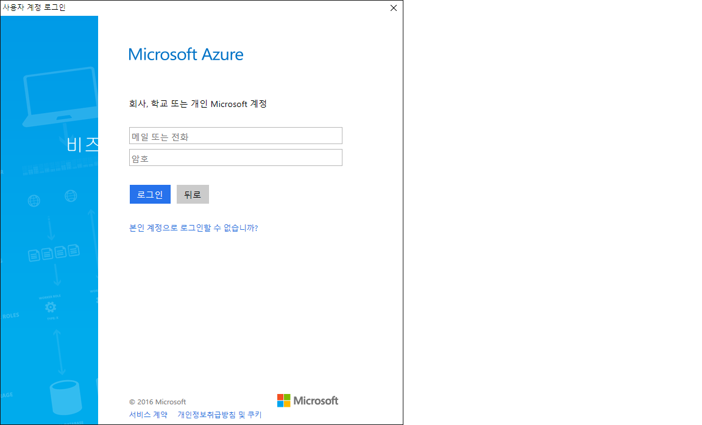

# Login to Azure Resource Manager

## Save Credential

```powershell
PS C:\WINDOWS\system32> Login-AzureRmAccount


Environment           : AzureCloud
Account               : <account>
TenantId              : <tenantid>
SubscriptionId        : <subscriptionid>
SubscriptionName      : <subscriptionname>
CurrentStorageAccount :
```


## Login using saved credential

```powershell
PS C:\WINDOWS\system32> $cred = Get-Credential
PS C:\WINDOWS\system32> Login-AzureRmAccount -Credential $cred -TenantId <tenantid>


Environment           : AzureCloud
Account               : <account>
TenantId              : <tenantid>
SubscriptionId        : <subscriptionid>
SubscriptionName      : <subscriptionname>
CurrentStorageAccount :
```